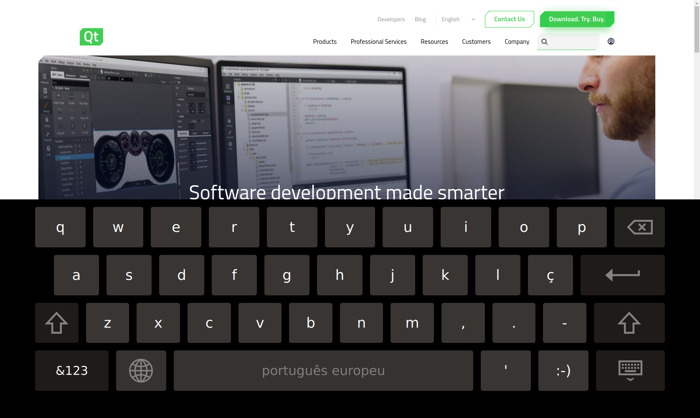

# Qt Kiosk Browser

The _Qt Kiosk Browser_ provides a simple browser which offers a nice set of features for use on a Kiosk device. It supports:

* Out of box screen saver
* Virtual Keyboard
* Highly configurable

Below is a screenshot of it showing the Qt website:

<p align="center">
    
</p>

## Settings

The settings file must be a JSON file.

### Available settings

#### ScreenSaverTimeout

Enter in screen saving mode after X milliseconds (0 to disable).

Defaults to 20 minutes.

#### RestartTimeout

After entering in screen saving mode, restart browser after X milliseconds (0 to disable).

Defaults to 3 minutes

#### WebEngineSettings

Configure browser properties and generic attributes, such as JavaScript support, focus behavior, and access to remote content.

Se all available properties at: https://doc.qt.io/qt-5.11/qml-qtwebengine-webenginesettings.html#properties

Example:

```json
{
    "ScreenSaverTimeout": 10000,
    "RestartTimeout": 2000,

    "WebEngineSettings": {
        "javascriptEnabled": false
    }
}
```
